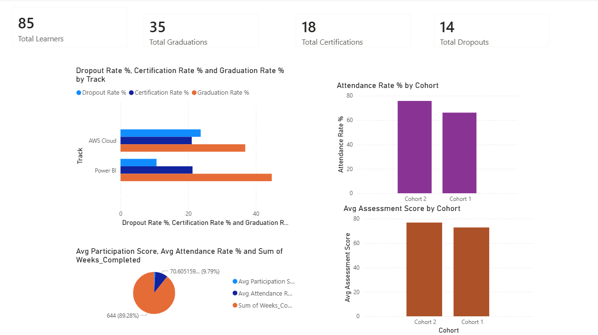
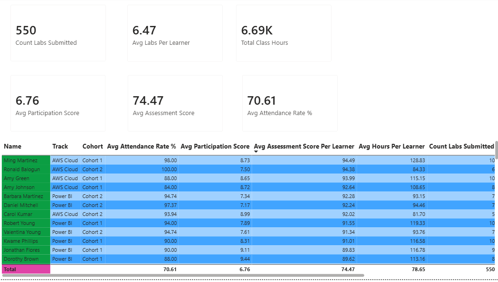

# Dare Careers — Power BI Dashboard

A two-page interactive Power BI dashboard tracking learner performance across four cohorts of the Dare Careers training programme (Power BI and AWS Cloud tracks).

**Live Report:** [View Dashboard on Power BI](https://app.powerbi.com/groups/me/reports/977c3b86-80c2-4a9b-b62c-dee09e6995b3/ff8c9a1483a5691572db?experience=power-bi)

---

## Dashboard

### Page 1 — Overall Performance Metrics

High-level summary of graduation, certification, dropout, attendance, and assessment scores across all cohorts and tracks.



**Visuals:**
- KPI cards: Total Learners, Total Graduations, Total Certifications, Total Dropouts
- Bar chart: Graduation Rate %, Certification Rate %, and Dropout Rate % by Track
- Column chart: Attendance Rate % by Cohort (with 70% reference line)
- Column chart: Avg Assessment Score by Cohort (with 70% reference line)
- Line chart: Avg Participation Score and Attendance Rate % trend by Week

**Slicers:** Cohort · Track · Certification Type · Learner Status

---

### Page 2 — Detailed Learner Insights

Drill-down view of individual learner metrics with colour-coded attendance and performance tier classification.



**Visuals:**
- KPI cards: Count Labs Submitted · Avg Labs Per Learner · Total Class Hours · Avg Participation Score · Avg Assessment Score · Avg Attendance Rate %
- Learner table: attendance, participation, assessment, hours, labs, graduation and certification status, performance tier
- Conditional formatting on Attendance %: red (<50%) · orange (50–70%) · green (≥70%)

**Slicers:** Cohort · Track · Month · Week · Learner Status · Program Status

---

## Data

Six CSV files generated from 10 weeks of programme data across 85 learners.

| Table in Power BI | Source file | Description |
|---|---|---|
| `Attendance` | `attendance_consolidated.csv` | Daily Zoom session records — attended if >30 min |
| `Participation` | `participation_consolidated.csv` | Daily participation scores and engagement |
| `Assessments` | `labs_quizzes_consolidated.csv` | Weekly lab and quiz scores |
| `LearnerStatus` | `learner_status_consolidated.csv` | Graduation, certification, and completion status |
| `Learners` | `learners_master.csv` | Master learner list |
| `DateDim` | `date_dim.csv` | Date dimension for time-based filtering |

**Cohorts:** Power BI Cohort 1 (25 learners) · Power BI Cohort 2 (22) · AWS Cohort 1 (20) · AWS Cohort 2 (18)

---

## Data Model

`LearnerStatus` is the central dimension table. All fact tables relate to it via `Learner_ID`.

```
LearnerStatus[Learner_ID]  →  Attendance[Learner_ID]
LearnerStatus[Learner_ID]  →  Participation[Learner_ID]
LearnerStatus[Learner_ID]  →  Assessments[Learner_ID]
DateDim[Date]              →  Attendance[Date]
```

All relationships are Many-to-one, single filter direction.

---

## DAX Measures

All 16 measures and the `Performance Tier` calculated column are documented in [`dax_formulas.md`](dax_formulas.md).

Performance tiers:

| Tier | Attendance | Assessment |
|---|---|---|
| High Performer | ≥ 85% | ≥ 80 |
| On Track | ≥ 70% | ≥ 65 |
| At Risk | ≥ 50% | any |
| Critical Risk | < 50% | any |

---

## Tech Stack

- **Power BI Desktop** — dashboard and DAX modelling
- **Python** (pandas) — data generation and processing
- **WSL2 Ubuntu** — development environment
