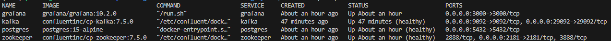
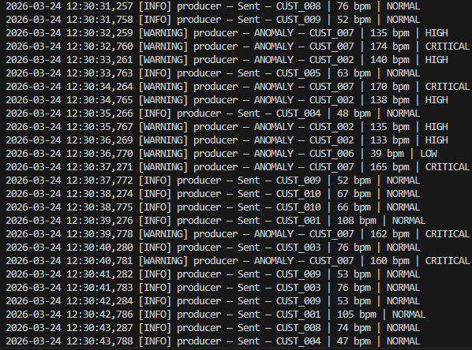
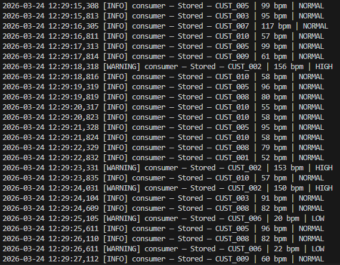
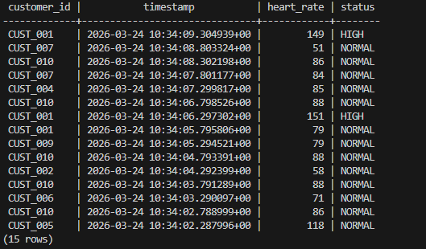
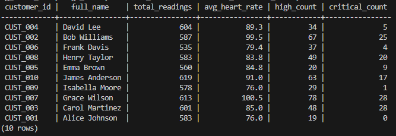
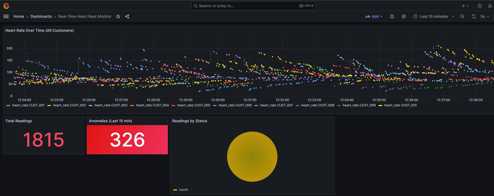

# Real-Time Customer Heart Beat Monitoring System

A production-style data engineering pipeline that simulates heart-rate sensor data for 10 patients, streams it through Apache Kafka, validates and classifies each reading, persists it to PostgreSQL, and visualises the live feed in a Grafana dashboard — all orchestrated with Docker Compose.

---

## Project Overview

This project demonstrates a complete real-time streaming architecture:

- A **synthetic data generator** produces realistic heart-rate readings with Gaussian noise, gradual drift, and configurable anomaly injection (spikes and dips).
- A **Kafka producer** serialises each reading to JSON and publishes it to the `heartbeat` topic.
- A **Kafka consumer** polls the topic, validates every message, classifies each reading (`NORMAL / HIGH / LOW / CRITICAL`), and writes the result to PostgreSQL using a manual-commit pattern that guarantees at-least-once delivery.
- **PostgreSQL** stores every reading in a time-series schema backed by three indexes and exposes two analytical views — one for anomalies, one for per-customer statistics.
- **Grafana** auto-provisions a live dashboard on startup, refreshing every 5 seconds to show time-series trends, anomaly counts, status breakdowns, and per-patient statistics.


## Architecture

```
┌─────────────────────────────────────────────────────────────┐
│                        Python (src/)                        │
│                                                             │
│  generator.py                                               │
│  ┌──────────────────────────────────┐                       │
│  │  HeartbeatGenerator              │                       │
│  │  • Gaussian noise + drift        │                       │
│  │  • Anomaly spikes / dips         │                       │
│  │  • 10 patients, each with a      │                       │
│  │    personalised base heart rate  │                       │
│  └────────────────┬─────────────────┘                       │
│                   │ HeartbeatReading (JSON)                  │
│  producer.py      ▼                                         │
│  ┌──────────────────────────────────┐                       │
│  │  confluent-kafka Producer        │                       │
│  │  topic: heartbeat                │                       │
│  └────────────────┬─────────────────┘                       │
└───────────────────┼─────────────────────────────────────────┘
                    │ Kafka (port 9092)
┌───────────────────▼─────────────────────────────────────────┐
│              Apache Kafka + Zookeeper                        │
│              confluentinc/cp-kafka:7.5.0                     │
└───────────────────┬─────────────────────────────────────────┘
                    │ poll / commit
┌───────────────────▼─────────────────────────────────────────┐
│                        Python (src/)                         │
│  consumer.py                                                 │
│  ┌──────────────────────────────────┐                        │
│  │  Validate → Classify → INSERT    │                        │
│  │  Manual offset commit            │                        │
│  └────────────────┬─────────────────┘                        │
└───────────────────┼──────────────────────────────────────────┘
                    │ psycopg2
┌───────────────────▼──────────────────────────────────────────┐
│              PostgreSQL 15                                    │
│              tables: customers, heartbeat_readings            │
│              views:  anomaly_readings, customer_heartbeat_stats│
└───────────────────┬──────────────────────────────────────────┘
                    │ SQL datasource
┌───────────────────▼──────────────────────────────────────────┐
│              Grafana 10.2                                     │
│              auto-provisioned dashboard                       │
│              http://localhost:3000                            │
└──────────────────────────────────────────────────────────────┘
```

---

## Heart Rate Classification

| Status | Condition | Meaning |
|---|---|---|
| `LOW` | ≤ 45 bpm | Bradycardia — dangerously slow |
| `NORMAL` | 46 – 129 bpm | Healthy range |
| `HIGH` | 130 – 159 bpm | Tachycardia — elevated |
| `CRITICAL` | ≥ 160 bpm | Severe tachycardia — immediate alert |


## Prerequisites

- **Docker Desktop** v4+ with Docker Compose v2 (WSL2 integration enabled on Windows)
- **Python 3.10+**

> **WSL2 note:** If you are running Docker Desktop on Windows with WSL2, ports are exposed on the virtual adapter at `10.255.255.254` (the nameserver shown in `/etc/resolv.conf`). The `.env` file is pre-configured for this address.

---

## Setup

### 1. Start all infrastructure services

```bash
docker compose up -d
```

Wait until all four containers are healthy:

```bash
docker compose ps
```

### 2. Create the Python virtual environment

```bash
python3 -m venv .venv
source .venv/bin/activate
pip install -r requirements.txt
```

### 3. Export environment variables

```bash
set -a && source .env && set +a
```

> Run this in every terminal session before starting the producer or consumer.

---

## Running the Pipeline

Open **three terminal windows** in the project root. Run the `set -a` export command in each one first.

### Terminal 1 — Producer

```bash
source .venv/bin/activate
set -a && source .env && set +a
cd src && python producer.py
```

### Terminal 2 — Consumer

```bash
source .venv/bin/activate
set -a && source .env && set +a
cd src && python consumer.py
```

### Terminal 3 — Verify PostgreSQL (optional)

```bash
docker exec -it postgres psql -U heartbeat_user -d heartbeat_db
```


## Grafana Dashboard

1. Open [http://localhost:3000](http://localhost:3000)
2. Log in with `admin / admin`
3. Navigate to **Dashboards → Real-Time Heart Beat Monitor**

The dashboard refreshes every 5 seconds and includes:

| Panel | Description |
|---|---|
| Heart Rate Over Time | Time-series chart of all readings |
| Total Readings | Count of records in the database |
| Anomaly Count | Readings with status HIGH, LOW or CRITICAL |
| Status Distribution | Breakdown by status category |
| Recent Anomalies | Latest non-normal readings with patient names |
| Customer Statistics | Per-patient averages, min/max, anomaly counts |

---

## Running Tests

No Docker or running services required.

```bash
source .venv/bin/activate
cd tests && python test_pipeline.py -v
```

14 tests across four test classes:

| Class | Tests |
|---|---|
| `TestHeartbeatReading` | Classification at each boundary, JSON round-trip |
| `TestGenerator` | Stream count, field validity, multi-customer coverage |
| `TestClassify` | All boundary conditions for the consumer classifier |
| `TestValidate` | Valid payload, missing fields, out-of-range values, type 


## Stopping the Pipeline

```bash
docker compose down

docker compose down -v
```

---

## Screenshots

### Containers Running


### Producer — Streaming Live Readings to Kafka


### Consumer — Validating and Storing to PostgreSQL


### PostgreSQL — Live Readings Table


### PostgreSQL — Per-Customer Statistics View


### Grafana — Live Dashboard

